

  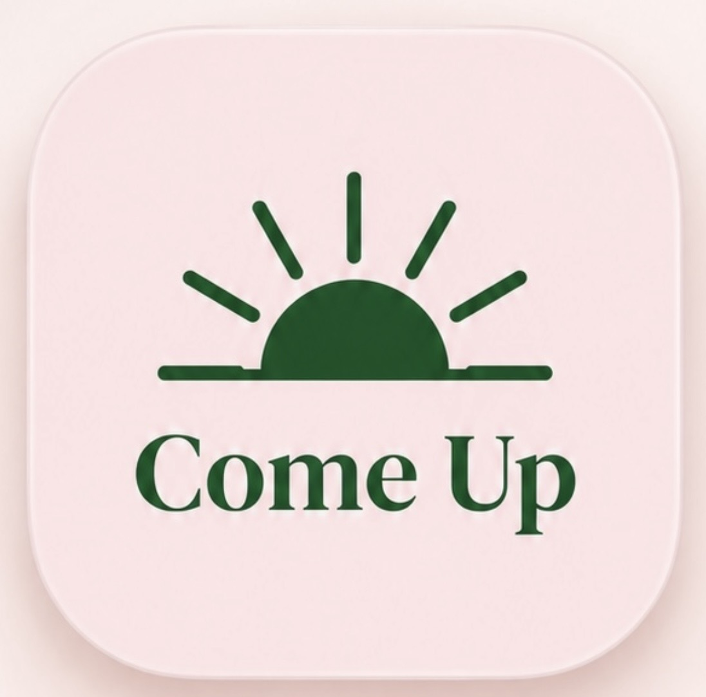

# Come Up

### Support for the moment you're in.

Come Up is a wellbeing app designed for the moments when you feel overwhelmed, stuck, unfocused, low on energy, or simply need a moment to reset.

Instead of expecting you to know which wellbeing technique you need, Come Up starts with a simpler question:

> **How can Come Up help right now?**

Choose how you're feeling, and Come Up helps make the next step smaller.

---

## What is Come Up?

Sometimes even deciding *how* to feel better can feel like another task.

Come Up was created around a different approach:

**Feeling → Support → Reset → One small next step**

You can simply choose:

- I'm overwhelmed
- I can't start
- I need focus
- I have no energy
- I need to calm down
- I don't know — choose for me

Come Up then guides you toward something appropriate for that moment.

No huge routine.  
No pressure to be productive.  
No need to explain everything first.

---

## Features

### Reset Me
A short three-step reset designed for moments when everything feels like too much.

### Break It Down
Turn something that feels overwhelming into a few smaller, more manageable steps.

### Emergency Calm
Quick breathing, grounding and calming tools for difficult moments.

### Low Battery
Support for the days when you have very little energy to give.

### Focus Tools
Gentle tools designed to make starting and concentrating feel more manageable.

### Mood & Energy Check-Ins
Quickly record how you're feeling and notice patterns over time.

### Cycle Tracking
Optional cycle, symptom, mood and energy tracking with inclusive handling for different cycle patterns.

### Meditation & Relaxation
Simple calming exercises, meditation and breathing tools.

### What Works for Me
Save your favourite tools and keep the things that help you easy to find.

### Small Wins
Record the little things that mattered — because progress doesn't always have to be huge.

---

## Designed differently

Come Up isn't intended to be another enormous library of wellbeing content.

The aim is to reduce decisions when you're already overwhelmed.

Instead of:

> *What would you like to do — meditate, journal, breathe or focus?*

Come Up starts with:

> **How are you feeling right now?**

You don't have to know what you need before you open the app.

---

## Available on iPhone

Come Up is live on the Apple App Store.

### [Download Come Up on the App Store](https://apps.apple.com/us/app/come-up/id6812744656)

---

## Android testing

Come Up is currently preparing for release on Google Play.

I'm looking for Android users who would like to help test the app and provide genuine feedback.

### [Join the Come Up Android Beta Testers group](https://groups.google.com/g/come-up-beta-testers)

Android testing link:

### [Open Come Up on Google Play](https://play.google.com/store/apps/details?id=com.base6aaaf9db3af208246305b2c2.app)

Feedback on design, usability, bugs and which tools are most useful is especially appreciated.

---

## Screenshots

## Screenshots

  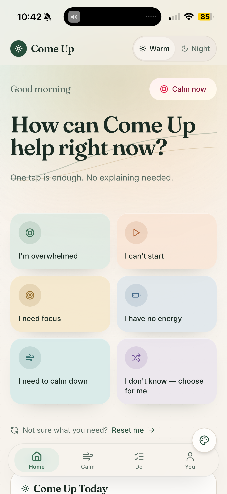
  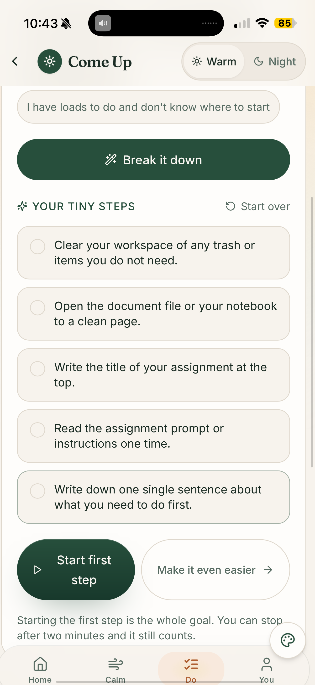
  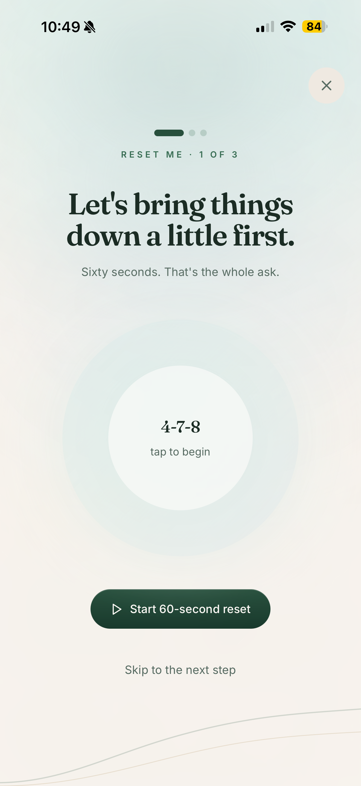

  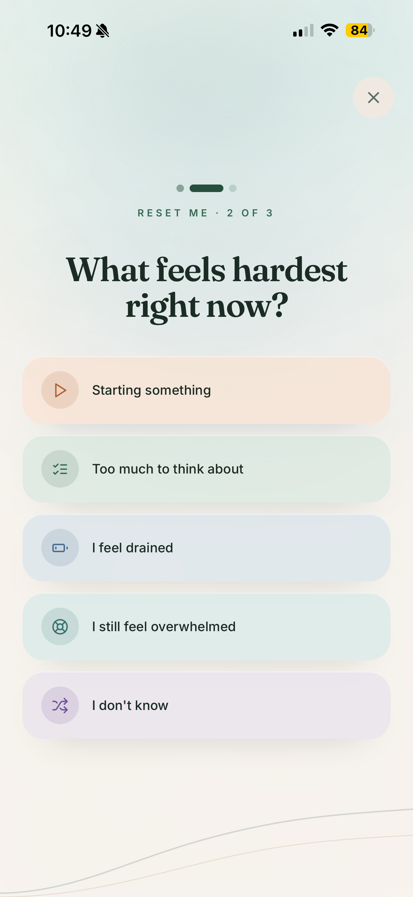
  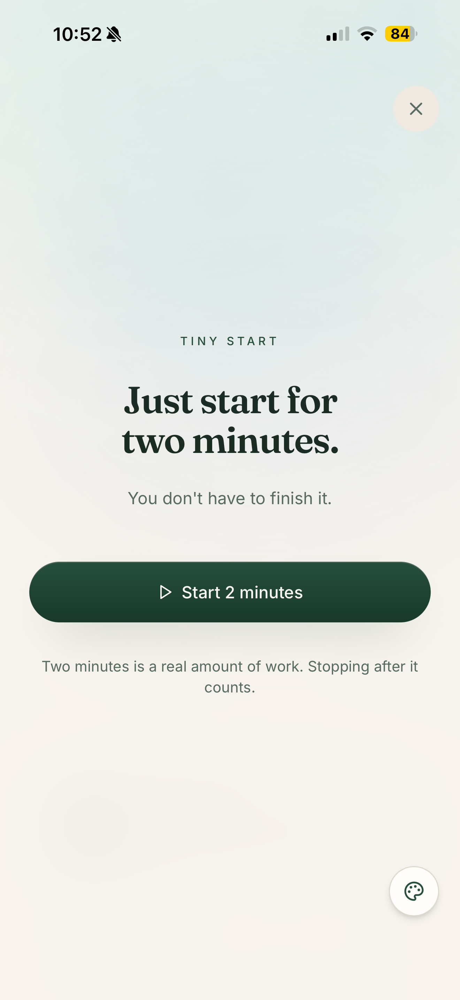
  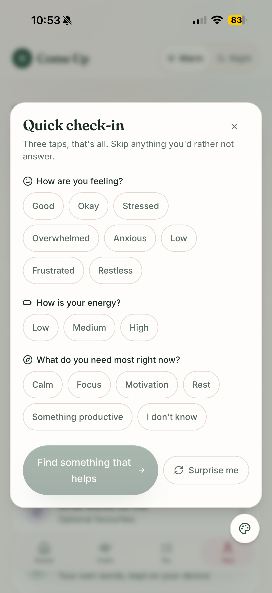

  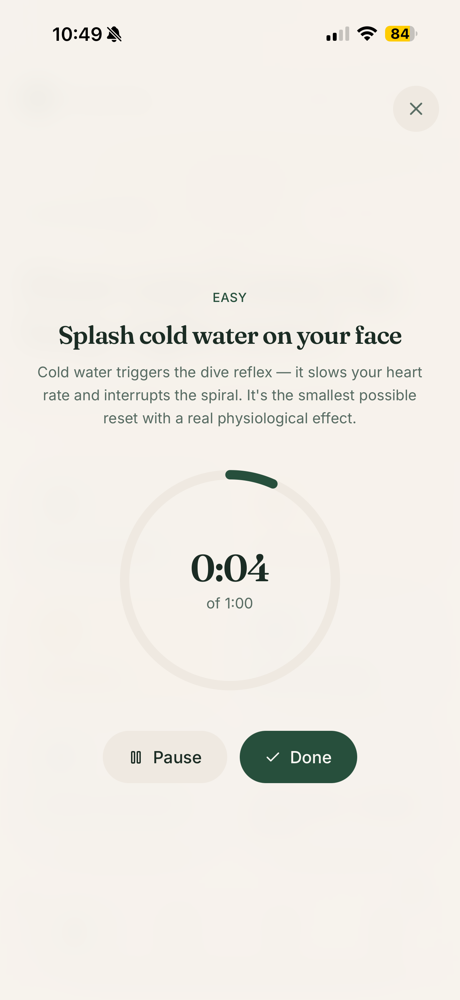
  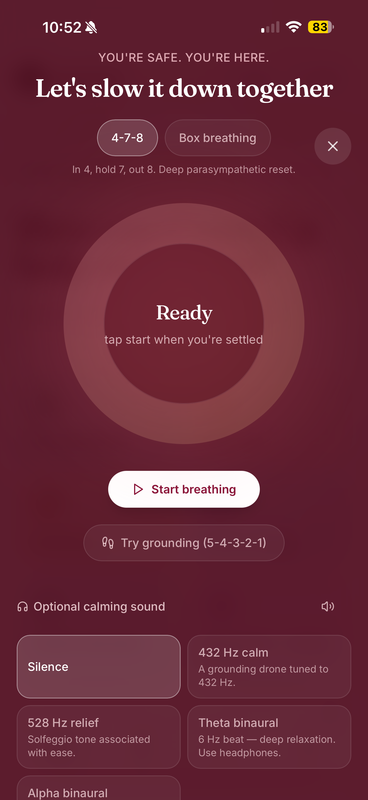
  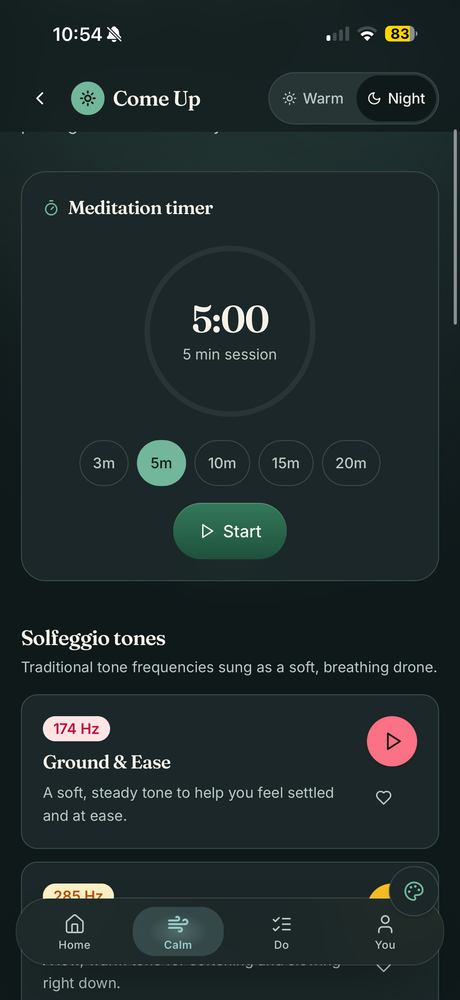

  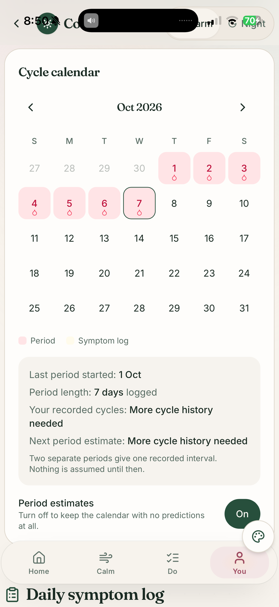

---

## The story behind Come Up

Come Up started from a simple idea:

Sometimes you don't need another long list of things you *should* be doing.

You need somewhere small to start.

I created Come Up after experiencing how difficult seemingly simple things can feel when your mind is overwhelmed, your energy is low, or starting feels harder than the task itself.

The goal isn't to push people into being more productive.

Sometimes Come Up helps you take a step forward.

Sometimes it helps you slow down.

Both matter.

Come Up is being built around the belief that wellbeing support should meet you where you are.

---

## The Come Up philosophy

### Support for the moment you're in.

### One tap is enough.

### Start smaller.

### Work with the energy you have.

### Progress doesn't have to be huge.

### Sometimes the next step is a reset.

---

## Built for everyone

Some of Come Up's design principles were influenced by experiences such as overwhelm, executive-function difficulties and ADHD-style task paralysis.

However, **Come Up isn't only an ADHD app**.

It's designed for anyone who sometimes feels overwhelmed, stuck, mentally drained, unfocused or in need of a calmer moment.

---

## Privacy

Come Up is designed with privacy in mind.

Most personal wellbeing information is stored locally on your device.

The current iOS version of Break It Down uses built-in processing rather than sending your task text to an external AI service.

Come Up does not use advertising or behavioural tracking.

Please refer to the official Come Up Privacy Policy for the most current information about data handling.

---

## Current development

### iOS
Available on the App Store.

### Android
Closed testing / Google Play release preparation.

### Come Up for Work
An early-stage concept exploring how the Come Up approach could support employee wellbeing through private, in-the-moment workplace support.

---

## Feedback & bug reports

If you find a problem or have an idea that could make Come Up better, you can use the **Issues** section of this GitHub repository.

When reporting a bug, it helps to include:

- iPhone or Android
- device model
- operating-system version
- what you were doing
- what you expected to happen
- what actually happened

Please don't include private health information or other sensitive personal information in public GitHub issues.

---

## Roadmap

Come Up is still growing.

Current priorities include:

- improving the iOS experience
- completing Android testing
- learning from real user feedback
- improving accessibility
- refining wellbeing and focus tools
- continuing to develop the Come Up brand
- exploring Come Up for Work

The roadmap will evolve based on what people actually find useful.

---

## Important note

Come Up is a general wellbeing and self-support tool.

It is not a medical service, diagnostic tool, crisis service, or substitute for professional healthcare.

---

## Come Up

**Reset. Refocus. Feel more like yourself.**

Built around one idea:

> **Come Up doesn't ask you to know what you need. It meets you where you are and helps make the next step smaller.**
